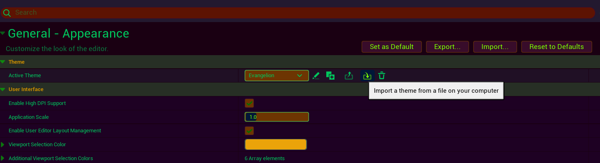
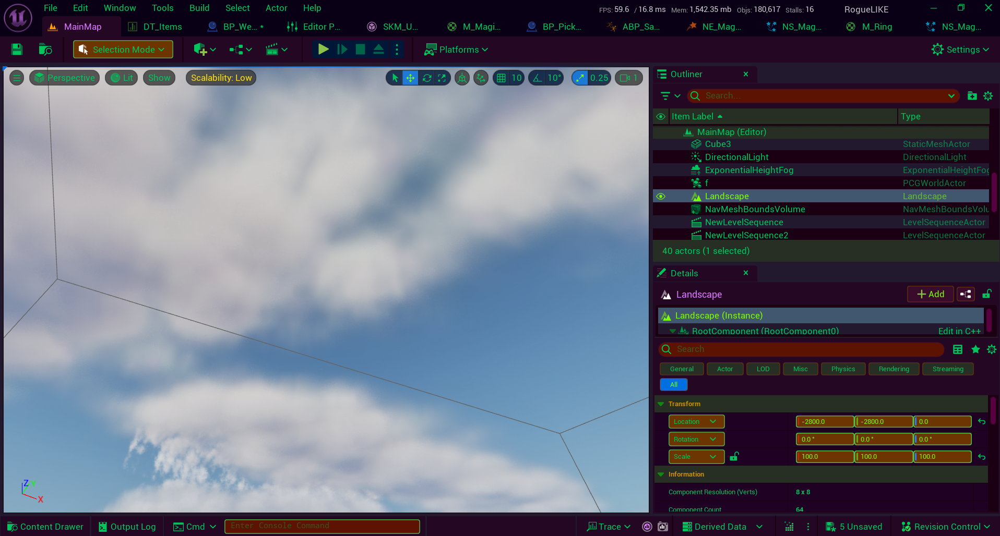
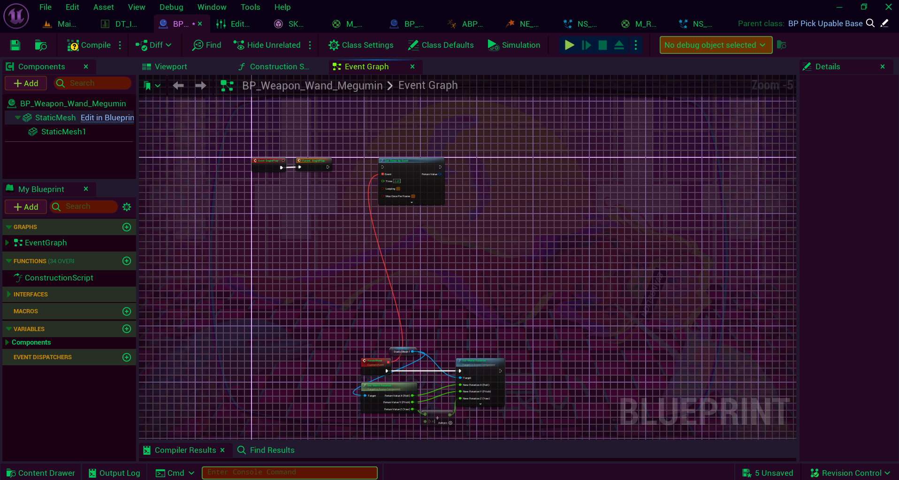
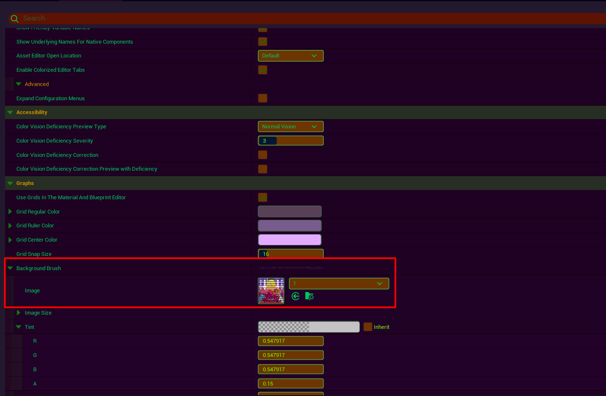

# Unreal editor theme collection
Evangelion theme for unreal. Download the theme you want and go to
`General -> Appearance -> Active Theme` and import the theme from the downloaded
location.

## Evangelion

## If you want same wallpaper add it here
Import image wallpaper from folder Wallpaper to unreal engine content browser 
`General -> Appearance -> Background Brush -> Image`

